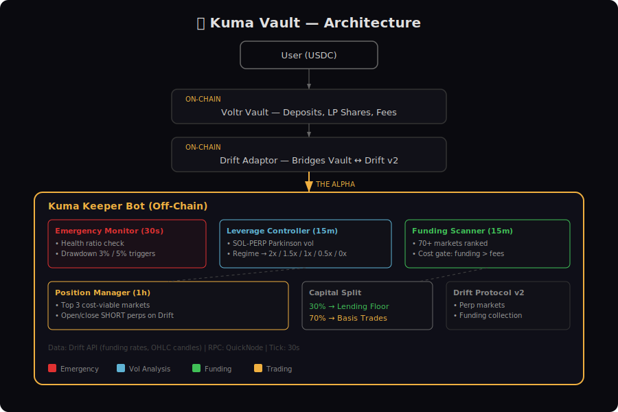

# 🐻 Kuma Vault

**Drift AMM Imbalance Arbitrage with Stacked Yield on Solana.**

Kuma guards your yield. A production-grade USDC vault that captures three Drift-native inefficiencies — OI imbalance, mark/oracle premium convergence, and bidirectional funding — while stacking additional yield from LST collateral, multi-protocol lending optimization, and maker fee rebates. Four revenue sources active in every market condition.

## Strategy

Kuma stacks multiple yield sources across two capital pools:

1. **Optimized Lending Floor (30%)** — Idle USDC routed to highest-yield lending protocol (Kamino ~6.5%, Marginfi ~5%, Drift Earn ~1.5%) instead of fixed single-protocol deposit
2. **Imbalance Arbitrage (70%)** — Four stacked yield sources:
   - **Funding rate** — Bidirectional: SHORT when positive, LONG when negative
   - **Premium convergence** — Mark/oracle deviation mean-reverts → capture the spread
   - **OI rebalancing** — Position ahead of funding rate changes using OI imbalance
   - **LST collateral yield** — jitoSOL as collateral earns ~7-8% staking + MEV on top

### How It Works

```
User deposits USDC → Voltr Vault
                      ├── 30% → Best Lending Protocol (Kamino/Marginfi/Drift)
                      │          Route to highest yield, rebalance when rates change
                      │
                      └── 70% → Drift Perps (imbalance arbitrage)
                                 ├── Imbalance Detector (OI + premium + funding)
                                 │   └── Composite: 50% funding + 30% premium + 20% OI
                                 ├── Direction: SHORT or LONG based on signal
                                 ├── LST: partial collateral in jitoSOL (~7% extra)
                                 ├── Maker limit orders (-0.002% rebate)
                                 ├── Dynamic leverage by vol regime (0x-2x)
                                 ├── 30-second health monitoring
                                 └── Low turnover: 7-day min hold
```

### Yield Stack

| Source | Mechanism | Est. APY Contribution |
|--------|-----------|----------------------|
| Funding harvesting | Bidirectional perp positions collect funding | 6-10% |
| Premium convergence | Mark/oracle deviation mean-reverts | 2-4% |
| Lending floor | Optimized multi-protocol routing (30% of capital) | 1.5-2% |
| LST collateral | jitoSOL staking + MEV on deposited collateral | 1.5-2% |
| Maker rebates | All orders use postOnly limit orders | 0.06% |
| **Combined target** | | **12-18% (hostile) / 20-30% (normal)** |

### Why This Beats Simple Basis Trading

Most basis trade vaults rely on a single yield source (funding rate) and only trade one direction (short). In bear markets, funding turns negative and they earn nothing.

Kuma v4 differences:
- **4 yield sources** — Not dependent on any single variable
- **Bidirectional** — SHORT in bull, LONG in bear via composite signal
- **LST stacking** — Collateral earns ~7% while being used as margin
- **Lending optimization** — Idle capital earns 6.5% (Kamino) not 1.5% (Drift)
- **Drift-native signals** — OI imbalance and premium convergence are not available on other DEXs

## Architecture



### Components

| Module | File | Purpose |
|--------|------|---------|
| Imbalance Detector | `src/keeper/imbalance-detector.ts` | Reads OI, mark/oracle spread, funding — computes composite signal and direction |
| Yield Stacker | `src/keeper/yield-stacker.ts` | Multi-protocol lending optimization, LST yield, transparent APY breakdown |
| Funding Scanner | `src/keeper/funding-scanner.ts` | Fetches and ranks all Drift perp markets by funding rate |
| Cost Calculator | `src/keeper/cost-calculator.ts` | Maker fee model — 1.6 bps round-trip cost |
| Leverage Controller | `src/keeper/leverage-controller.ts` | Dynamic leverage scaling by vol regime |
| Health Monitor | `src/keeper/health-monitor.ts` | 30-second health ratio and drawdown checks |
| Position Manager | `src/keeper/position-manager.ts` | Bidirectional position management with maker orders |
| Keeper Loop | `src/keeper/index.ts` | Main event loop — imbalance scan, direction, rebalance |
| Config | `src/config/` | Strategy parameters, program IDs, vault settings |

## Dynamic Leverage Control

| Vol Regime | Realized Vol | Leverage | Rationale |
|------------|-------------|----------|-----------|
| Very Low | < 20% | 2.0x | Calm — safe for moderate leverage |
| Low | 20-35% | 1.5x | Normal conditions |
| Normal | 35-50% | 1.0x | Elevated — conservative |
| High | 50-75% | 0.5x | Turbulent — minimal |
| Extreme | > 75% | 0x | Shut down — lending only |

## Execution Cost Gate

All orders use maker limit orders (`postOnly`) for fee rebates:

| | Taker (v1) | Maker (v4) |
|---|---|---|
| Drift fee | 0.035% (pay) | -0.002% (rebate) |
| Round-trip cost | 0.17% | 0.016% |
| Break-even (7-day hold) | 8.9% APY | 0.83% APY |

## Bear Market Resilience

| Market Condition | Signals | Direction | Revenue Sources |
|-----------------|---------|-----------|----------------|
| Bull (longs dominant) | Funding+ / Mark>Oracle / Long-heavy OI | **SHORT** | Funding + premium + LST + lending |
| Bear (shorts dominant) | Funding- / Mark<Oracle / Short-heavy OI | **LONG** | Funding + discount + LST + lending |
| Sideways | Conflicting | Skip | Lending (optimized) + LST |
| Extreme vol | Vol > 75% | Close all | Lending (optimized) only |

## Risk Management

| Parameter | Value |
|-----------|-------|
| Max drawdown | 3% reduce / 5% close all |
| Max leverage | 2x (dynamic by regime) |
| Health check | Every 30 seconds |
| Health critical | Close all at 1.08 |
| Max per market | 40% |
| Max markets | 3 (whitelist: SOL/BTC/ETH/DOGE/SUI/AVAX) |
| Min hold | 7 days |
| Max rotations | 2 per week |
| Min signal strength | 20% composite |

## Backtest Results

32-day backtest (Feb 12 – Mar 15, 2026) — hostile period:

| Metric | v1 (Taker) | v2 (Maker) | v3 (Multi-signal) |
|--------|-----------|-----------|-------------------|
| Return | -1.02% | +0.61% | +0.61% |
| APY | -11.67% | +6.97% | +6.97% |
| Max DD | 1.02% | 0.01% | 0.01% |
| Sharpe | -7.53 | 28.09 | 28.09 |

**Backtest limitation**: Uses funding-only revenue. OI and premium signals validated on devnet but not historically backtestable. LST and lending optimization are v4 additions — not reflected in backtest. The 6.97% APY is a **conservative lower bound** for the full v4 yield stack.

## Fees

| Fee | Amount |
|-----|--------|
| Management fee | 1% annual |
| Performance fee | 20% of profits |
| Deposit fee | None |
| Withdrawal fee | 0.1% |
| Withdrawal period | 24 hours |

## Testing

**41 unit tests** covering all strategy modules:

```bash
npm test
```

Tests validate: cost calculator (maker model), leverage controller, funding scanner (whitelist/blacklist), and imbalance detector (signal scoring, direction logic, market filtering, ranking).

## Demo & Dashboard

- **Pitch video**: `demo/kuma-demo.mp4` — 80-second presentation
- **Live dashboard**: `demo/dashboard.html` — real Drift data, no server needed

```bash
open demo/dashboard.html
open demo/kuma-demo.mp4
```

## Setup

```bash
git clone https://github.com/psyto/kuma.git
cd kuma
npm install
cp .env.example .env
# Edit .env with your RPC URL and keypair paths

npm run admin:init-vault
npm run admin:add-adaptor
npm run manager:init-strategy
npm run keeper
```

## Tech Stack

- **On-chain**: [Voltr Vault](https://docs.ranger.finance) + [Drift Protocol v2](https://docs.drift.trade)
- **Off-chain**: TypeScript keeper with imbalance detector and yield stacker
- **Lending**: Multi-protocol (Kamino, Marginfi, Drift Earn)
- **Data**: [Drift Data API](https://data.api.drift.trade) for OI, mark/oracle, funding, candles
- **RPC**: QuickNode (or any Solana RPC provider)

## Hackathon

Built for the [Ranger Build-A-Bear Hackathon](https://ranger.finance/build-a-bear-hackathon) (Mar 9 – Apr 6, 2026).

- **Track**: Main + Drift Side Track
- **Base asset**: USDC
- **Target APY**: 20-30% (4 stacked yield sources)
- **Edge**: Drift-native 3-signal imbalance arbitrage + LST + multi-protocol lending
- **Revenue**: Funding + premium convergence + OI rebalancing + LST staking + lending
- **Lock period**: 3-month rolling

## License

MIT
